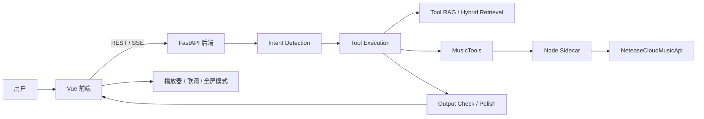
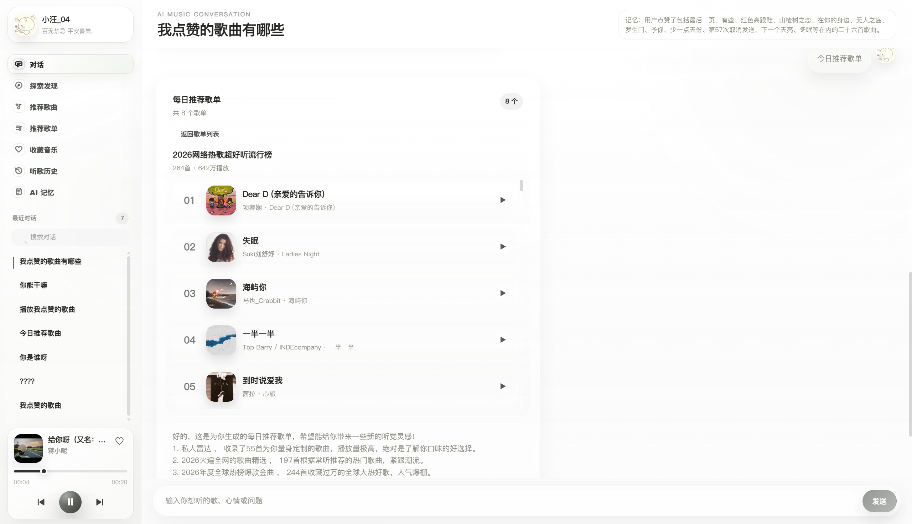
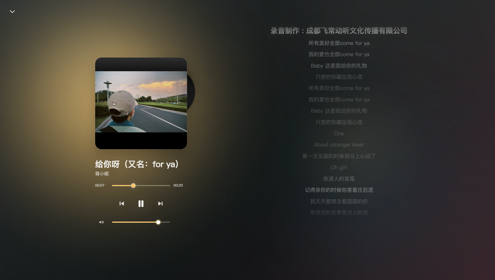

# 音迹

音迹是一个面向 Agent 应用开发方向的智能音乐助手项目，内置助手名为“小听”。

它把 LLM、多阶段工具调用、流式对话、富内容卡片 UI 和内置音乐播放器放到同一条产品链路里：用户提出音乐问题，后端先理解意图，再执行音乐工具或进行工具检索，最后把结构化结果以流式方式返回到前端，并直接联动歌曲卡片、歌词和播放器体验。

## 项目定位

这个项目更偏 `agent application engineering`，不是单纯的 Prompt Demo。

我重点想展示的是：

- 如何把一个音乐助手拆成稳定的多阶段 Agent 链路
- 如何把工具调用过程可视化展示给用户，而不是只显示一个加载中的圆点
- 如何把工具结果整理成前端可消费的结构化内容，而不是一大段文本
- 如何把聊天、音乐播放、歌词滚动、全屏沉浸式 UI 串成一个完整体验


## 核心亮点

- 三层 Agent 链路：`意图识别 -> 工具执行 -> 输出整理/润色`
- 工具优先、RAG 兜底：优先使用已知音乐工具，能力不够时再通过 Tool RAG 召回更多工具
- 流式响应：后端通过 SSE 持续推送文本、进度状态和工具状态
- 可视化执行过程：前端会展示当前阶段、工具运行状态和思考占位气泡
- 富内容结果：歌曲、歌单、专辑等结果会直接渲染为可交互卡片
- 内置播放器：支持播放/暂停、上一首/下一首、音量调节、歌词滚动、全屏模式、心动模式
- 会话持久化：支持历史会话列表、重命名、删除、多轮上下文记忆摘要
- 工程稳定性处理：通过 FastAPI + Node sidecar 调用网易云接口，并用音频直链重定向绕开后端长时间音频代理的不稳定问题

## 小听能做什么

- 找歌、搜歌手、搜专辑、搜歌单
- 获取歌词、播放链接、下载链接
- 查看点赞歌曲、推荐歌曲、推荐歌单
- 展示歌曲/歌单/专辑富卡片结果
- 结合上下文进行多轮音乐问答
- 在处理过程中同步展示“理解需求 / 执行工具 / 输出结果”等阶段

## 架构概览



## Agent 链路

### 1. 意图识别层

- 对用户问题进行改写
- 提取参数和可能缺失的参数
- 判断是否需要直接回答，还是进入音乐工具链路

对应目录：

- `musicAgents/intent_detection`

### 2. 工具执行层

- 优先执行已知音乐工具
- 如果工具不够，再通过 Tool RAG 召回候选工具
- 支持多轮工具串联，例如先搜歌再拿歌曲 id，再请求下载链接或歌词

对应目录：

- `musicAgents/tool_execution`
- `tools/MusicTools`
- `RagService/ToolRag`

### 3. 输出整理层

- 把工具结果整理成自然语言回复，设定指定回复风格
- 把歌曲、歌单、专辑等结果整理成前端富卡片 payload
- 控制输出不要泄露内部工具字段、原始 JSON 和内部 ID
- 对输出结果进行检测，过滤敏感信息

对应目录：

- `musicAgents/output_check`

## 前端体验

前端不是传统聊天框，而是一个带音乐控制能力的 Agent 界面。

包含的主要交互：

- 会话侧边栏：新建、搜索、重命名、删除对话
- 流式回复：边生成边展示
- 思考气泡：展示当前阶段，例如“正在分析用户需求”“调用 liked_songs”“正在输出”
- 工具状态展示：展示当前调用了哪些工具、工具执行是否成功
- 富卡片消息：歌曲、歌单、专辑结果直接渲染，不需要用户自己再复制搜索
- 播放器：支持歌曲播放、歌词滚动、封面悬停动效、全屏沉浸模式
- 心动模式：支持基于已点赞歌曲和推荐歌曲构建连续播放队列

对应目录：

- `agent_app/src/views`
- `agent_app/src/components`
- `agent_app/src/services`

## 效果展示

### 音乐助手主界面

侧边栏、最近对话、音乐推荐卡片、结构化歌曲列表和底部播放器被整合在同一个工作台里。用户可以直接通过自然语言让 Agent 搜歌、生成推荐、播放列表或查看收藏音乐。



### 全屏沉浸式播放器

点击播放器封面后进入全屏音乐模式，展示大封面、黑胶视觉、播放控制、音量控制和歌词滚动，让聊天式音乐助手也具备完整的听歌体验。



## 技术栈

### 前端

- Vue 3
- Vue Router
- Vite
- Axios

### 后端

- FastAPI
- Uvicorn
- LangChain Core / Community
- DashScope / Tongyi
- Chroma
- BM25 / hybrid retrieval
- SQLite

### 音乐能力

- NeteaseCloudMusicApi
- Node sidecar
- 自定义 MusicTools 工具层

## 项目结构

```text
.
├─ agent_app/                  # 前端 + FastAPI 网关
│  ├─ src/                     # Vue 页面、组件、播放器、消息渲染
│  ├─ routers/                 # 会话、流式聊天、播放、歌词等接口
│  ├─ scripts/                 # 启动脚本、NCM sidecar
│  └─ main.py                  # FastAPI 入口
├─ musicAgents/                # 三层 Agent 主链路
│  ├─ intent_detection/
│  ├─ tool_execution/
│  ├─ output_check/
│  └─ main.py
├─ tools/MusicTools/           # 音乐工具封装
├─ RagService/                 # Tool RAG / Doc RAG / retrieval core
├─ Account_setting/            # 登录与 cookie 管理
├─ env_settings.py             # 根目录 .env 加载
├─ .env.example                # 根配置示例
└─ .gitignore
```

## 最小配置

当前项目最少只需要两个环境变量：

```env
DASHSCOPE_API_KEY=YOUR_DASHSCOPE_API_KEY
NCM_MUSIC_U=YOUR_NCM_MUSIC_U_COOKIE
```

说明：

- `DASHSCOPE_API_KEY` 用于大模型、Embedding、Rerank 等能力
- `NCM_MUSIC_U` 用于调用需要登录态的网易云接口
- 其他配置项都是可选项，见 [`.env.example`](./.env.example)

前端如果需要自定义后端地址，可以额外配置：

```env
VITE_API_BASE_URL=http://127.0.0.1:8002
```


## 本地运行

### 环境要求

- Python 3.10+
- Node.js 18+
- npm
- DashScope API Key
- 网易云 `MUSIC_U`

### 1. 配置环境变量

在仓库根目录创建 `.env`：

```env
DASHSCOPE_API_KEY=YOUR_DASHSCOPE_API_KEY
NCM_MUSIC_U=YOUR_NCM_MUSIC_U_COOKIE
```

如果需要单独指定前端请求地址，可以在 `agent_app` 下创建 `.env`：

```env
VITE_API_BASE_URL=http://127.0.0.1:8002
```

### 2. 安装前端依赖

```bash
cd agent_app
npm install
```

### 3. 安装 Python 依赖

当前仓库已经包含 `agent_app/pyproject.toml`，但根目录还没有统一整理成完整的 `requirements.txt`。

目前代码中实际用到的核心依赖包括：

- `fastapi`
- `uvicorn`
- `pydantic`
- `langchain-community`
- `langchain-core`
- `langchain-chroma`
- `langchain-text-splitters`
- `dashscope`
- `requests`
- `numpy`
- `jieba`
- `rank-bm25`
- `qrcode`
- `pyqrcode`
- `pillow`

### 4. 启动项目

在 `agent_app` 目录下运行：

```bash
cd agent_app
npm run start
```

默认会同时启动：

- FastAPI 后端：`http://127.0.0.1:8002`
- Vite 前端：`http://127.0.0.1:5173`

## 安全说明

为了方便公开展示，这个仓库已经做过一轮配置脱敏：

- 所有真实密钥和 Cookie 都应保存在本地 `.env`
- `.env`、日志文件、SQLite 数据、cookie 文件都不应提交
- 公开仓库只保留占位符配置和示例说明

如果你基于这个项目继续开发，请不要提交：

- `.env`
- `logs/`
- `Account_setting/cookie.json`
- `agent_app/data/`

## 这个项目展示了什么能力

如果从 Agent 应用开发的角度来看，这个项目主要展示的是：

- 多阶段 Agent 工作流设计
- 工具调用与 Tool RAG 结合
- 流式对话与前端状态同步
- 结构化结果到交互式 UI 的映射
- 多轮记忆摘要与会话持久化
- 从模型、工具、后端到前端播放器的一体化体验设计

## 当前已知不足

如果继续打磨到更适合长期维护的开源仓库，下一步我会优先做这些事情：

- 补一个统一的根目录 Python 依赖文件
- 进一步清理少量历史编码和注释问题
- 增加更系统的测试，尤其是工具链路和播放器链路
- 补充 Demo 视频和在线演示说明

## Demo

- GitHub: https://github.com/xiaowang0410/yinji-music-agent
- Bilibili: 待补充演示视频链接

---

如果你也在做 Agent 应用、音乐产品，或者工具调用类项目，欢迎交流。
